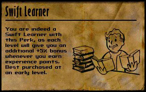
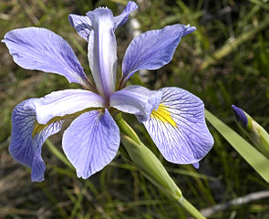
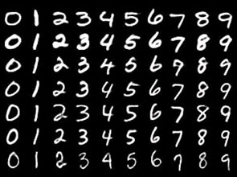

# SwiftLearner: Scala machine learning library

 

These are some simply written machine learning algorithms.
They are easier to follow than the optimized libraries, and easier to tweak if you want to experiment.
They use plain Java types and have few or no dependencies. SwiftLearner is easy to fork;
you can also copy-paste the individual methods.

Some of the methods are very short, thanks to the elegance of the classic algorithms,
and the expressive power of Scala. Some are optimized slightly, just enough to accommodate the test datasets.
Those are not idiomatic Scala, closer to CS 101 while loops, which are longer, but perform better.
They are still easy to follow.

Use this project as a prototyping library, a cookbook, or a cheat sheet.
For high performance and rich features, there are better options.
Still, these methods are fully functional and work well for small datasets.

The name comes from Fallout, the greatest game ever. Fallout is a trademark of Bethesda Softworks LLC.

To make one ML enthusiast happy, **please star or fork this project.**

## Contents

* [Perceptron](src/main/scala/com/danylchuk/swiftlearner/nn/perceptron)
([tests](src/test/scala/com/danylchuk/swiftlearner/nn/perceptron))
A single layer, single node granddaddy of neural networks.
* [Backprop](src/main/scala/com/danylchuk/swiftlearner/nn/backprop)
([tests](src/test/scala/com/danylchuk/swiftlearner/nn/backprop))
A neural network with one hidden layer, using backpropagation.
* [Genetic Algorithm](src/main/scala/com/danylchuk/swiftlearner/ga)
([tests](src/test/scala/com/danylchuk/swiftlearner/ga))
Genetic Algorithm with elitist tournament selection.
* [Gaussian Naive Bayes](src/main/scala/com/danylchuk/swiftlearner/bayes/GaussianNaiveBayes.scala)
([tests](src/test/scala/com/danylchuk/swiftlearner/bayes/GaussianNaiveBayesTest.scala))
Gaussian naive Bayes classifier for continuous parameters.
* [k-Nearest Neighbors](src/main/scala/com/danylchuk/swiftlearner/knn)
([tests](src/test/scala/com/danylchuk/swiftlearner/knn))
k-Nearest Neighbors classifier.
* [k-Means](src/main/scala/com/danylchuk/swiftlearner/kmeans)
([tests](src/test/scala/com/danylchuk/swiftlearner/kmeans))
k-Means clustering.
* [Softmax](src/main/scala/com/danylchuk/swiftlearner/softmax)
([tests](src/test/scala/com/danylchuk/swiftlearner/softmax))
Softmax (multinomial logistic) regression with SGD and AdaGrad.

## Examples

The examples I wrote so far are small enough to fit in the tests, so take a look there.

One example is classifying the classic
[Fisher Iris flower dataset](https://en.wikipedia.org/wiki/Iris_flower_data_set)
with different algorithms:
* [BackpropClassifier](src/test/scala/com/danylchuk/swiftlearner/nn/backprop/BackpropClassifierTest.scala): 96% accuracy
* [GeneticIris](src/test/scala/com/danylchuk/swiftlearner/ga/GeneticTest.scala): 94% accuracy
* [GaussianNaiveBayes](src/test/scala/com/danylchuk/swiftlearner/bayes/GaussianNaiveBayesTest.scala): 94% accuracy
* [KNearestNeighbors](src/test/scala/com/danylchuk/swiftlearner/knn/KNearestNeighborsTest.scala): 94% accuracy
* [KMeans](src/test/scala/com/danylchuk/swiftlearner/kmeans/KMeansTest.scala): semi-supervised clustering, 87% accuracy
* [SoftmaxClassifier](src/test/scala/com/danylchuk/swiftlearner/softmax/SoftmaxTest.scala): 90% accuracy

The accuracy for backprop and the genetic algorithm goes higher with longer training;
these figures are for the quick settings in the automated tests.

Another classic example is classifying the handwritten digits from the
[MNIST database](https://en.wikipedia.org/wiki/MNIST_database):
* [SoftmaxClassifier](src/test/scala/com/danylchuk/swiftlearner/softmax/SoftmaxTest.scala): 92% accuracy
* [BackpropClassifier](src/test/scala/com/danylchuk/swiftlearner/nn/backprop/BackpropClassifierTest.scala): 95% accuracy

## License

This is free software under a BSD-style license.
Copyright (c) 2016 Valentyn Danylchuk. See [LICENSE](LICENSE) for details.